# 🎬 Netflix Content Analytics Project  
**Python (Pandas) + Tableau Dashboard | End-to-End Data Analytics Pipeline**

This project provides a complete data engineering + analytics workflow:
- Data Cleaning in Python  
- EDA and Transformation  
- Genre Explosion  
- KPI and Trend Visualizations in Tableau  
- Final Dashboard Published to Tableau Public  

The goal:  
👉 **Understand patterns, trends, genres, and country contributions within Netflix’s catalog**  
using clean, professional BI processes.

---

# 📁 Project Structure

```

c:/Projects/Netflix_Content_Analysis/
├── requirements.txt
├── dashboard/
│   ├── Tableau_1_Netflix.twb
│   └── images/
│       ├── Dashboard_1.png
│       ├── Dashboard_2.png
│       ├── KPI1_TotalTitles.png
│       ├── KPI2_PieChart.png
│       ├── KPI3_DonutChart.png
│       ├── KPI4_TitlesOverTime.png
│       ├── Movie_Duration_Histogram.png
│       ├── Top_Countries_Top10.png
│       ├── Top_Countries.png
│       ├── Top_Genres_Top10.png
│       └── Top_Genres.png
├── data/
│   ├── processed/
│   │   ├── data_profile.json
│   │   ├── netflix_clean.csv
│   │   └── netflix_genres_exploded.csv
│   └── raw/
│       └── netflix_titles.csv
├── docs/
│   ├── Phase1_Planning.docx
│   ├── Phase2 Design Netflix Tableau Project_pipeline.docx
│   ├── Phase3.docx
│   ├── Phase4_Step by step_Tableau desktop public.docx
│   └── Phase4.docx
├── logs/
├── src/
│   ├── **init**.py
│   └── data_prep/
│       ├── clean.py
│       ├── utils.py
│       └── tests/
│           └── test_parsing.py
└── README.md

```

---

# 🧭 **Project Overview**

This project takes the **Kaggle Netflix Titles Dataset**, cleans it using a custom Python pipeline, explodes multi-value fields (like Genres), and visualizes the content insights using **Tableau**.

### Core Objectives:
- Prepare a clean, analysis-ready dataset  
- Analyze growth trends (titles added yearly)  
- Analyze genre distribution  
- Find top content-producing countries  
- Understand movie duration patterns  
- Build a polished Tableau dashboard  

---

# 🔄 **End-to-End Data Flow (Mermaid Diagram with Colors)**

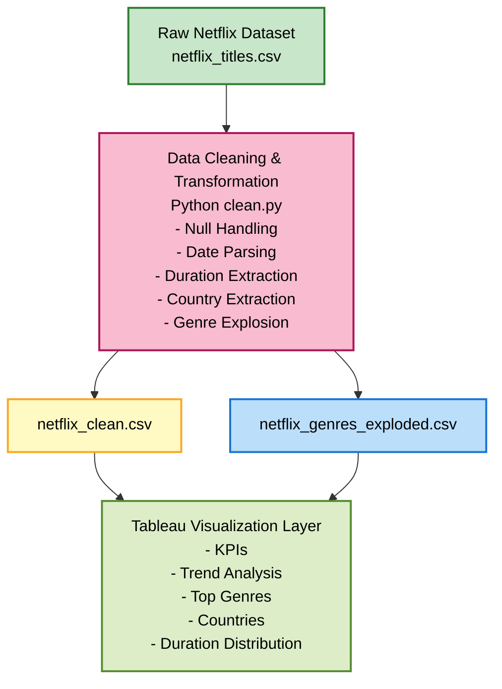

---

# 🧹 **Data Cleaning & Transformation (Python)**

### ✔ Key Operations in `clean.py`

* Remove duplicates
* Handle null values
* Parse dates into multiple formats (Year, Month, Quarter)
* Extract duration numbers (convert "90 min" → 90)
* Extract primary country
* Explode genres into separate rows
* Export processed datasets to `data/processed/`

### 📤 Output Files:

1. `netflix_clean.csv` — fully cleaned master dataset
2. `netflix_genres_exploded.csv` — exploded genre dataset

---

# 📊 **Tableau Dashboard**

## 🌐 **Dashboard Preview**

<table>
  <tr>
    <td>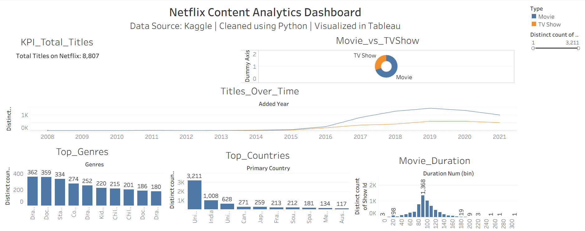</td>
      View it in Tableau Public [Here](https://public.tableau.com/app/profile/anshul.vemisetty/viz/Netflix_Data_Analytics_Project1_1/Netflix_Analytics_Dashboard).
    <td>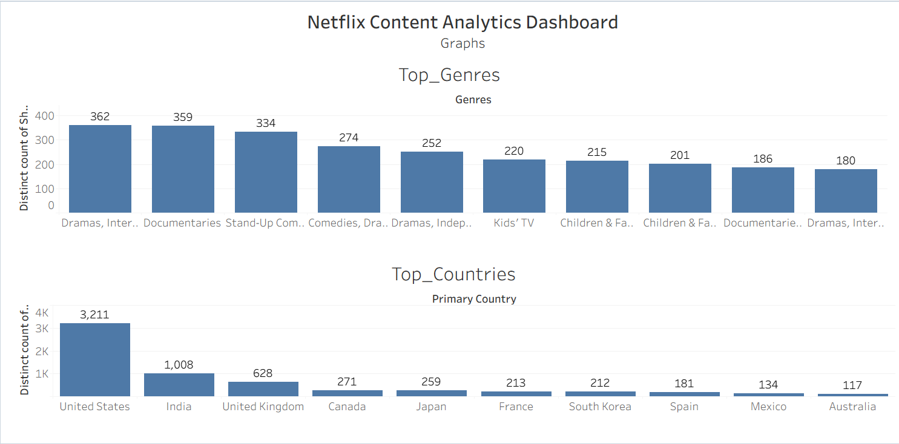</td>
      View it in Tableau Public [Here](https://public.tableau.com/app/profile/anshul.vemisetty/viz/Netflix_Data_Analytics_Project1/Netflix_Analytics_Dashboard).
  </tr>
</table>

---

# 🏆 **KPI Visuals**

<table>
  <tr>
    <td>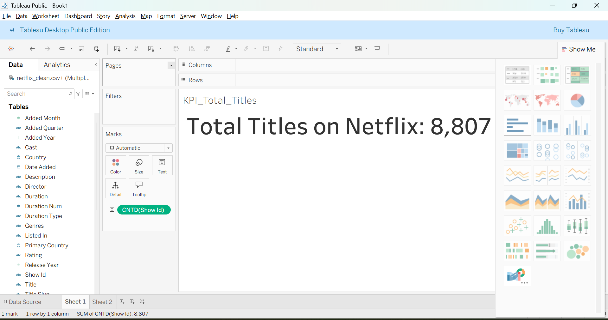</td>
    <td>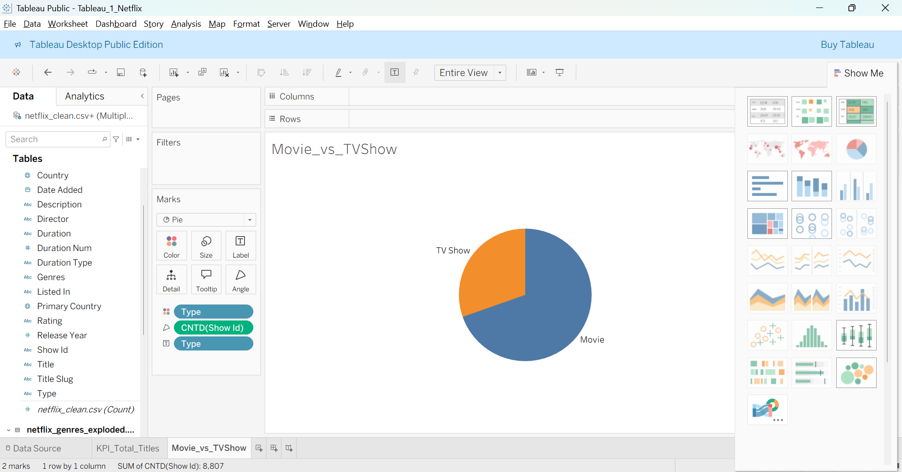</td>
    <td>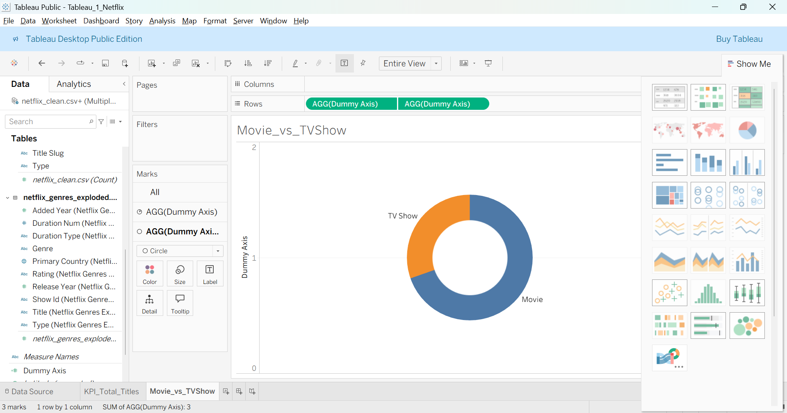</td>
  </tr>
</table>

### 📈 Titles Added Over Time

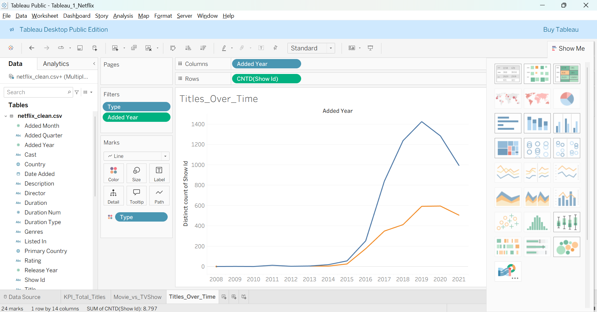

---

# 🎭 **Genre Analysis**

<table>
  <tr>
    <td>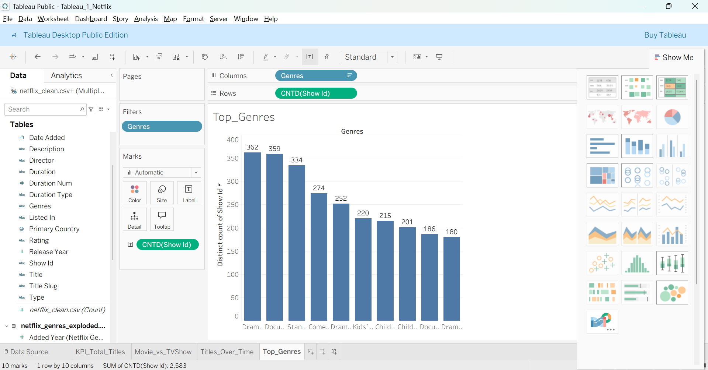</td>
    <td>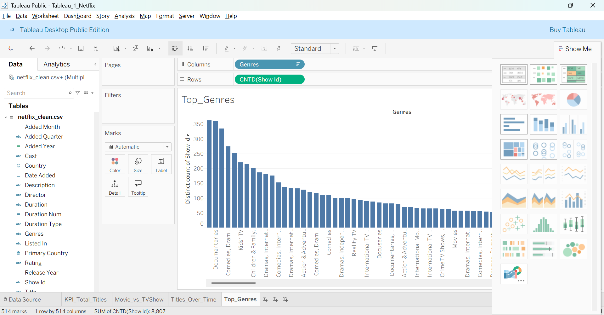</td>
  </tr>
</table>

---

# 🌍 **Country Insights**

<table>
  <tr>
    <td>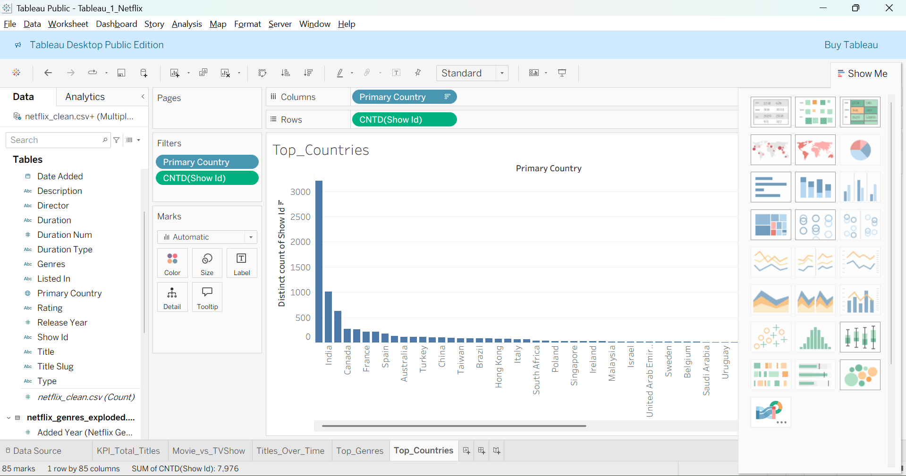</td>
    <td>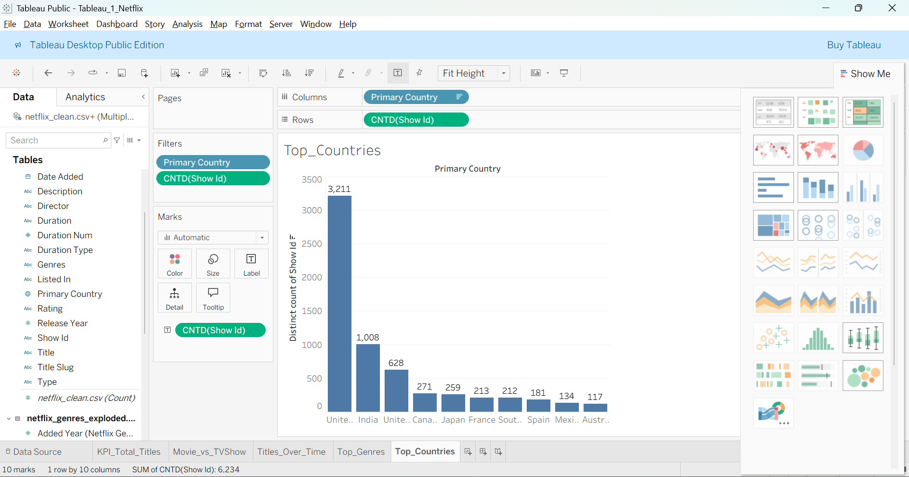</td>
  </tr>
</table>

---

# 🎞️ **Movie Duration Distribution**

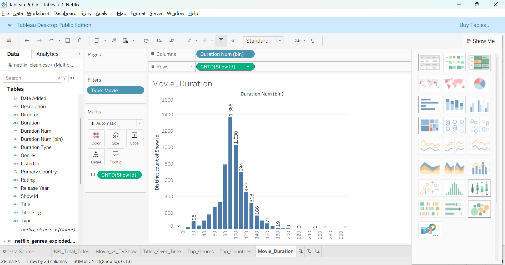

---

# 🚀 **How to Run the Project (Local Setup)**

### 1️⃣ Clone the repository

```bash
git clone https://github.com/yourusername/Netflix_Content_Analysis.git
cd Netflix_Content_Analysis
```

### 2️⃣ Create environment & install dependencies

```bash
python -m venv .venv
.venv\Scripts\activate      # Windows
pip install -r requirements.txt
```

### 3️⃣ Run data cleaning pipeline

```bash
python src/data_prep/clean.py --input data/raw/netflix_titles.csv --out_dir data/processed
```

### 4️⃣ Open Tableau Dashboard

* Open: `dashboard/Tableau_1_Netflix.twb`
* Or manually connect to:

  * `data/processed/netflix_clean.csv`
  * `data/processed/netflix_genres_exploded.csv`

---

# 💡 **Key Insights Discovered**

### 🎬 Content Mix

* Movies dominate Netflix's catalog over TV Shows.

### 📈 Trends

* Major spike in content addition between **2016 – 2020**.

### 🎭 Genre Popularity

* Leading genres: **Drama**, **International Movies**, **Documentaries**, **Comedies**.

### 🌍 Country Contribution

* Top producing countries:
  **United States, India, United Kingdom, Canada**.

### 🎞️ Duration

* Most movies fall between **85–120 minutes**, forming a clear bell curve.

---

# 🛠️ **Tech Stack**

| Layer           | Tools                            |
| --------------- | -------------------------------- |
| Data Cleaning   | Python, Pandas                   |
| Data Validation | Custom parsing tests             |
| Visualization   | Tableau Desktop / Tableau Public |
| Documentation   | Microsoft Word                   |

---

# 👤 Author

**Anshul V**

